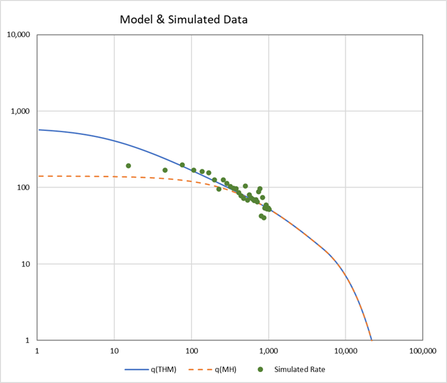

# thm-excel

#### THM Functions to call as Excel UDFs

___

The source file `thm.bas` provides the Transient Hyperbolic Model functions to call as Excel UDFs.

The Excel workbook `THM Examples.xlsx` provides usage examples. For a detailed reference on all functions and diagnostics, as well as implementations in Python, see the
[petbox-dca documentation](https://petbox-dca.readthedocs.io/en/latest/api.html#petbox.dca.THM). You may also find the manuscript introducing the Transient Hyperbolic Model on [onepetro.org](https://doi.org/10.2118/167242-MS). The functions included here are written for performance for calling from Excel, and feature minimal abstraction.

A translation is provided from transient hyperbolic model to the modified hyperbolic model; meaning, both models are calculated from the same set of parameters. The calculation is straightforward as the transient hyperbolic model *generalizes* the modified hyperbolic model. A match point is given for the translation, which can be any time value but has been found to work well with a value of 4.0 * t_elf.

The well data is simulated, and contains autocorrelation, random bias, random noise, and correlated outliers (downtime). The purpose of the data is to generate test cases to highlight the differences between the models. This image shows a case of long duration transient flow. The modified hyperbolic model cannot match the early-time data *and* yield an accurate forecast with the data in this example. Fitting the early-time data with the modified hyperbolic model would yield an overestimation of well recovery.

___

### Example Comparison of Transient Hyperbolic and Modified Hyperbolic

